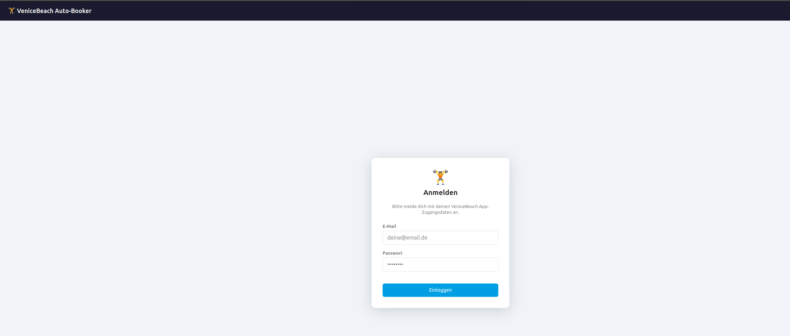
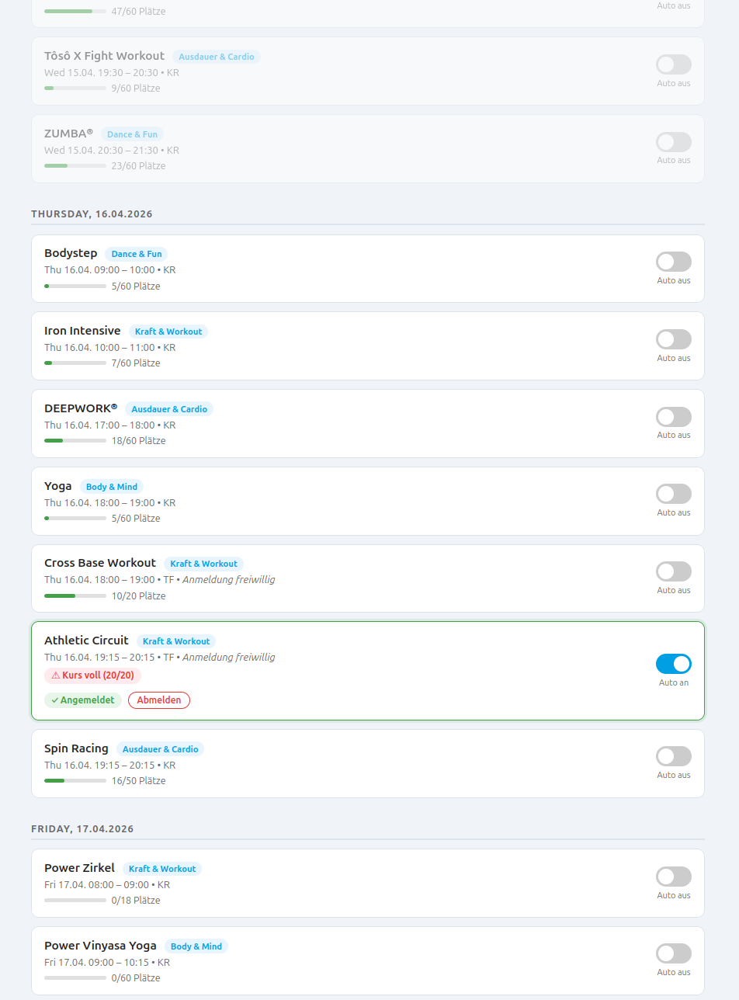

# VeniceBeach Karlsruhe Sudstadt AutoBooker

Geht euch auf der Lauer liegen für eine Kursanmeldung auf den Sack? mir auch.

Kurse können im Vorraus in einem Wochenplan festgelegt werden zur Buchung, der Hintergrundprozess (Ein Python WebServer basierend auf Flask) versucht dann ab dem ersten möglichen Zeitpunkt jede Minute eine Buchung oder setzt dich auf die Warteliste (falls es eine gibt).
Die Verwendung der App macht natürlich nur als dauerhaft laufender Hintergrundprozess/Server Sinn (Server, NAS, RaspberryPI,...)

Alles läuft bei euch lokal auf dem Rechner, es wird kein Cloud-Service verwendet.


Ein lokales Testen der App (ohne Installation der App selbst als Systemservice) ist durch ausführen von ```python app.py```, sofern die Python-Dependencies aus requirements.txt installiert wurden, möglich (und öffnen im Browser unter ```http://localhost:5000```).




## Sicherheitsaspekte 
Euer Passwort und Benutzername wird niergends gespeichert (könnt ihr im Source Code prüfen oder von einem Chatbot prüfen lassen). 

Was gespeichert wird, sind die Token die man vom Authentifizierungssystem nach dem Login erhält. Dies ist technisch notwendig um automatisiert Buchungen zu einem späteren Zeitpunkt durchführen zu können. 


Unter ```Linux``` werden access_token und refresh_token in der SQL Datenbank verschlüsselt gespeichert mit Hilfe der Fernet Bibliothek. Der Schlüssel selbst ist als Umgebungsvariable gespeichert ($VENICEBEACH_SECRET_KEY). 

Die install.sh führt folgende Schritte zusätzlich zu dem eigentlichen Setup des Services durch:
- Generiert beim ersten Installieren einen Fernet-Key und schreibt ihn in secrets.env (Berechtigungen: 600, nur für den eigenen User lesbar)
- Vorhandenes secrets.env wird bei Reinstallation nicht überschrieben (sonst wären gespeicherte Tokens unlesbar)
- Service-Datei referenziert secrets.env via EnvironmentFile=
- Deinstallation fragt optional ob secrets.env gelöscht werden soll 


Unter ```Windows``` werden access_token und refresh_token im "Windows Credential Manager" via keyring gespeichert. 

## Setup für Linux

```install.sh ``` ausführen. 

Das Installationsskript versucht eine Installation unter Root-Rechten/Sudo, wenn dies nicht gegeben ist wird ein User-Service unter ```~./config/systemd/user/``` angelegt und mit ```loginctl enable-linger``` registriert damit der Service auch ohne aktiven Login ab dem nächsten Neustart im Hintergrund läuft.  

Das Skript automatisiert die folgenden Schritte:

1. Prüft Python 3.10+
2. Erstellt venv/ und installiert alle Pakete
3. Generiert die systemd-Service-Datei mit korrektem Pfad/User
4. Aktiviert den Service mit systemctl enable (startet automatisch beim Booten)
5. Gibt nützliche Verwaltungsbefehle am Ende aus

Im Browser dann unter ```http://localhost:5000``` erreichbar (ausser Port 5000 war schon belegt als der Service gestartet wurde)


## Deinstallation Linux

``` install.sh --uninstall ``` ausführen

## Setup für Windows

Einfach nur  ```install.bat``` aufrufen, die folgenden Schritte sollten dann automatisiert ablaufen:

1. Ruft install.ps1 mit umgangener ExecutionPolicy auf (kein manueller Schritt nötig)
2. Prüft Vorhandensein von Python 3.10+ auf deinem System
3. Erstellt eine virtuelle Umgebung (venv/) für und installiert Pakete
4. Erzeugt start_hidden.vbs — startet pythonw.exe ohne Konsolenfenster
5. Registriert einen Task im Windows-Aufgabenplaner: startet automatisch bei jedem Login
6. Fragt am Ende ob der Browser geöffnet werden sol

Im Browser dann unter ```http://localhost:5000``` erreichbar (ausser Port 5000 war schon belegt als der Service gestartet wurde)


## Deinstallation unter Windows
```install.bat /uninstall ``` ausführen